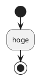
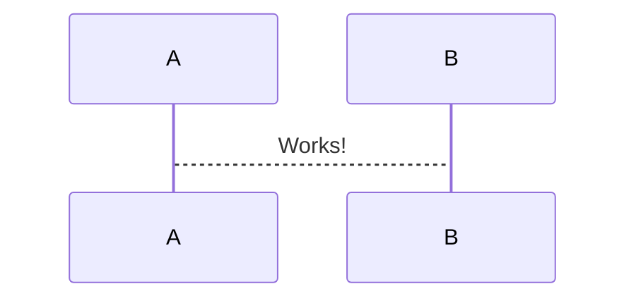
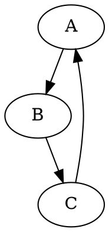

---
html:
  embed_local_images: false
  embed_svg: true
  offline: false
  toc: undefined

print_background: false
export_on_save:
  html: false
---

@import "./css/sepia.less"

# README

## 利用方法

インストール

- VSCode
  拡張機能
- Markdown All in One
- MarkdownPreviewEnhanced

のインストールを行う

## Markdown の仕様に関するメモ

- {#tableid} id の指定ができる（タイトル属性だけ）
- ==ハイライト==
- :smile:

**Perser の拡張は可能**

## HTML を用いた記法

1. トグルリスト

<details>
<summary>Qiita(キータ)は、プログラマのための技術情報共有サービスです。</summary>
<p>
プログラミングに関することをどんどん投稿して、知識を記録、共有しましょう。
Qiitaに投稿すると、自分のコードやノウハウを見やすい形で残すことができます。
技術情報はテキストファイルへのメモではなく、タグを付けた文章、シンタックスハイライトされたコードで保存することで初めて再利用可能な知識になる、そうQiitaでは考えています。
</p>
</details>

以上のように記述することでトグルリストとして記述可能
ネストも可能だが、現状インデントの対応は行っていない

2. PlantUML
   planuml.jar へのパスを通すことが必要
   実行環境として Java が必要



3. 数式

```math
\left( \sum_{k=1}^n a_k b_k \right)^{!!2} \leq
\left( \sum_{k=1}^n a_k^2 \right) \left( \sum_{k=1}^n b_k^2 \right)
```

4. 外部サイトの読み込み
   Markdown としての記法は用意されていないので iframe タグを利用して読み込むのが最も簡便だと思われる
   細かい設定に関しては自由度を減らして CSS に設定してしまうほうが良い
   **HTML 以外では表示不可のため注意**

<iframe src="https://docs.google.com/presentation/d/e/2PACX-1vQGCGO4BKNKmsm3Oml53J5vTzK7dRBqXHoABnftOb5n3HLiixWzNCMmwc2w7InQig/embed?start=false&loop=false&delayms=3000" frameborder="0" width="500" height="569" allowfullscreen="true" mozallowfullscreen="true" webkitallowfullscreen="true"></iframe>

<iframe src="https://www.slideshare.net/slideshow/embed_code/key/B6SfqHFrWhihpr" width="595" height="485" frameborder="0" marginwidth="0" marginheight="0" scrolling="no" style="border:1px solid #CCC; border-width:1px; margin-bottom:5px; max-width: 100%;" allowfullscreen> </iframe>

<iframe src="https://codesandbox.io/s/angular" width="595" height="485" frameborder="0" marginwidth="0" marginheight="0" style="border:1px solid #CCC; border-width:1px; margin-bottom:5px; max-width: 100%;" allowfullscreen> </iframe>

CodePen は MarkdwonPreviewEnhaced では表示不可

## CriticMarkup

CriticMarkup は Markdown や HTML ファイルを差分表示するマークアップと関連ツール
最後の Contribution が２０１４年なのでいまいち

- 追加 {++ ++}
- 削除 {-- --}
- 代入 {~~ ~> ~~}
- コメント {>> <<}
- ハイライト {== ==}{>> <<}

## コードブロック内で利用できる物（デフォルト）

```sequence {theme=hand}
Andrew->China: Says Hello
Note right of China: China thinks\nabout it
China-->Andrew: How are you?
Andrew->>China: I am good thanks!
```

```flow
st=>start: Start:>http://www.google.com[blank]
e=>end:>http://www.google.com
op1=>operation: My Operation
sub1=>subroutine: My Subroutine
cond=>condition: Yes
or No?:>http://www.google.com
io=>inputoutput: catch something...
para=>parallel: parallel tasks

st->op1->cond
cond(yes)->io->e
cond(no)->para
para(path1, bottom)->sub1(right)->op1
para(path2, top)->op1
```





```ditaa {cmd=true args=["-E"]}
  +--------+   +-------+    +-------+
  |        | --+ ditaa +--> |       |
  |  Text  |   +-------+    |diagram|
  |Document|   |!magic!|    |       |
  |     {d}|   |       |    |       |
  +---+----+   +-------+    +-------+
      :                         ^
      |       Lots of work      |
      +-------------------------+
```

```vega-lite
{
  "$schema": "https://vega.github.io/schema/vega-lite/v3.json",
  "description": "A simple bar chart with embedded data.",
  "data": {
    "values": [
      {"a": "A", "b": 28}, {"a": "B", "b": 55}, {"a": "C", "b": 43},
      {"a": "D", "b": 91}, {"a": "E", "b": 81}, {"a": "F", "b": 53},
      {"a": "G", "b": 19}, {"a": "H", "b": 87}, {"a": "I", "b": 52}
    ]
  },
  "mark": "line",
  "encoding": {
    "x": {"field": "a", "type": "ordinal"},
    "y": {"field": "b", "type": "quantitative"}
  }
}
```

```puml
:遊ぶ;
:レポート作成;
```

```python {cmd=true matplotlib=true}
import matplotlib.pyplot as plt
import numpy as np
x = np.arange(-10, 10, 0.01)
y_sin = np.sin(x)
y_cos = np.cos(x)
plt.plot(x, y_sin)
plt.plot(x, y_cos)
plt.show()
```
