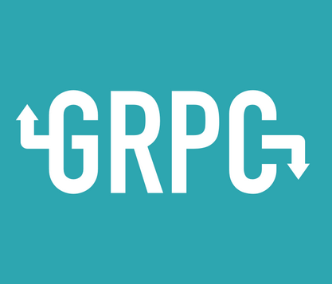
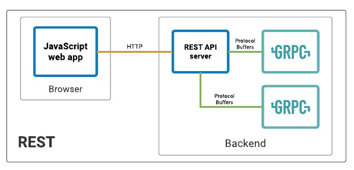
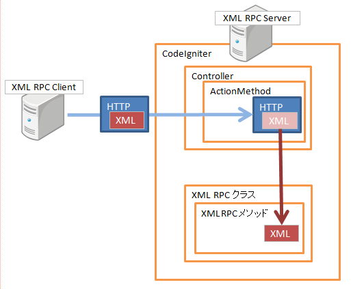
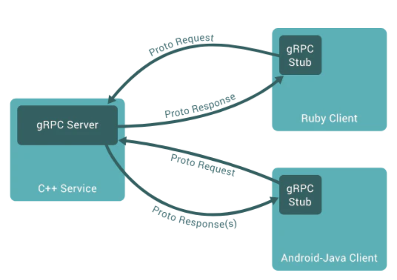
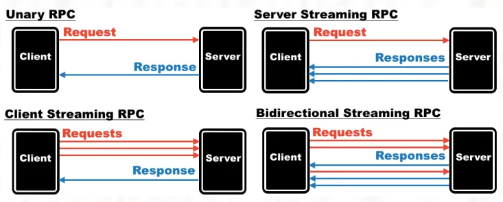
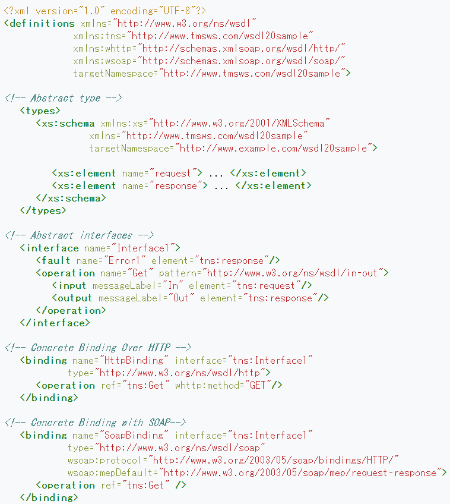
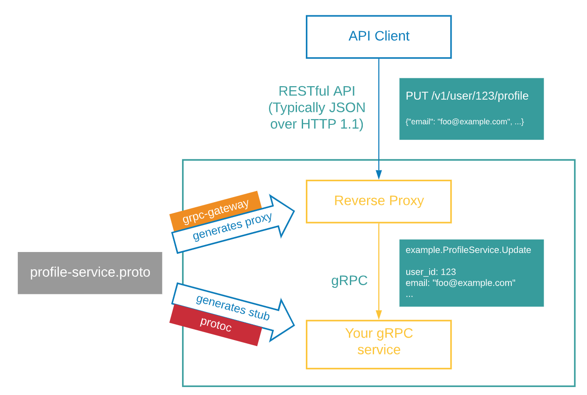
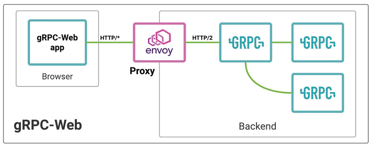
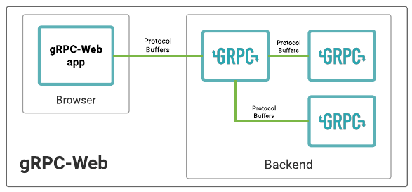

<!-- _class: top -->



# gRPC 勉強会

2021 年 05 月 14 日
廣岩　広路

---

<!-- _class: section_sp  -->

# 今日説明する内容

</br>

- どこで使われる技術か
- RPC とは
- gRPC の特徴
- インターフェイス定義言語(IDE) とは
- ProtcolBuffer について
- その他関連するライブラリ、プラグイン等

---

<!-- _class: section_sp cus_pos_l_50 -->

# 何に利用される技術か

</br>

主にマイクロサービスにおける
サービス間の通信で利用されている

- バイナリを利用することで高速な
  通信が可能

- HTTP/2 を利用した高速な通信

- 複数言語に対応
  C, C++, C#, Dart, Go, Java, Kotlin, Node.js, Objective-C, PHP, Python, Ruby



---

<!-- _class: section_sp cus_pos_l_60 -->

# そもそも RPC とは

</br>

- RPC(Remote Procedure Call)
  遠隔手続き呼び出し
  他サーバ上の関数(手続き)を呼び出して実行する
  ことを可能にする手法
- 同じ RPC の仕様に準拠していれば言語非依存
- 呼び出しの規約
  インターフェイス記述言語（IDL）で記述する
  記述したインターフェイスからクライアント
  及びサーバーのコードを生成する



---

<!-- _class: section_sp cus_pos_l_55 -->

# gRPC の特徴

HTTP/2 の仕様に則った RPC プロトコル

特徴

- 高速
- 特定の言語非依存
- 特定の IDL 非依存
- シリアライズフォーマットを指定しない
- Stream での通信
- 型安全

デメリット

- 可読性の欠如
- 言語によって内部実装に差異がある



---

<!-- _class: section_sp cus_pos_l_5 -->

# 通信方式



---

<!-- _class: section_sp cus_pos_l_54 -->

# IDL とは

</br>

インターフェイスを定義する言語
特定の言語に依存する場合もしない場合もある
定義の仕方も様々

右の画像は WSDL(SOAP) の例
以下を定義

- どこにあるのか
- どんなフォーマットを使うのか
- どんな通信プロトコルを使うのか

</br>

記述した情報からコードの生成が可能



---

<!-- _class: section_sp cus_pos_l_40 -->

# Protocol Buffers とは

デフォルトでの gRPC の IDL

- シリアライザ/デシリアライザ
  バイナリ等に変換

</br>

- データフォーマット
  Json, XML 等のフォーマットと同様の物

</br>

- スキーマを定義する言語
  API のスキーマを定義
  定義したスキーマから各言語で コード を自動生成
  Json, XML 等のスキーマ定義言語として用いることが可能

---

<!-- _class: section_sp cus_pos_l_40 -->

# Protocol Buffers とは

</br>

```java
//helloworld.proto

service Greeter {
  rpc SayHello (HelloRequest) returns (stream HelloReply) {}
}

message HelloRequest {
  string name = 1; //数字部分がユニークID
}

message HelloReply {
  string message = 1;
}
```

---

<!-- _class: section_sp cus_pos_l_40 -->

# Protocol Buffers とは

後方互換性

- 古いスキーマから生成されたコードで新しいスキーマのデータを利用可能

  - フィールド名をリネーム
    フィールド番号を変えないこと
  - フィールドを追加・削除
    追加削除したものと重複するフィールド番号が使わないこと
  - 特定のデータ型間の型変更
    互換性のある型間での型変更を行うこと

---

<!-- _class: section_sp cus_pos_l_40 -->

# Protocol Buffers とは

</br>

注意

あまり大きいデータを取り扱うには向いていない
公式ドキュメント曰く、1Mbyte 以上のデータを扱いたい場合は別のフォーマットを使った方がよい

---

<!-- _class: section_sp cus_pos_l_40 -->

# Protocol Buffers コンパイラ

ProtcolBuffers のコンパイラである protoc 及び
protoc のプラグインを用いることによって様々な拡張が可能

- swagger(OpenAPI)用の json の生成

- REST を受け取るための Proxy のコード生成

- API のインターフェイスコードの生成

---

<!-- _class: section_sp cus_pos_l_20 -->

# gRPC 実装の流れ

</br>


---

<!-- _class: section_sp cus_pos_l_0 -->

# gRPC 実装の流れ 1 サービスの定義

ProtcolBuffers を用いたサービス(API)の定義を行う

```java
//helloworld.proto

service Greeter {
  rpc SayHello (HelloRequest) returns (stream HelloReply) {}
}

message HelloRequest {
  string name = 1;
}

message HelloReply {
  string message = 1;
}
```

---

<!-- _class: section_sp cus_pos_l_0 -->

# gRPC 実装の流れ 2 コード生成

protoc という ProtcolBuffer 用のコンパイラを利用する
gradle, maven 等でビルド実行時に生成することが可能

</br>

```shell
$ protoc --java_out=src/main/java protos/helloworld.proto
```

---

<!-- _class: section_sp cus_pos_l_0 -->

# gRPC 実装の流れ 3 サーバー側の実装

```java
public class App {
    public static void main(String[] args) throws Exception {
        Server server = ServerBuilder.forPort(50051)
                .addService(new GreeterImpl())
                .build()
                .start();
        Runtime.getRuntime().addShutdownHook(new Thread(server::shutdown));
        server.awaitTermination();
    }
}
```

```java
public class GreeterImpl extends GreeterGrpc.GreeterImplBase {
    @Override
    public void sayHello(HelloRequest req, StreamObserver<HelloReply> responseObserver) {
        HelloReply reply = HelloReply.newBuilder()
            .setMessage("Hello " + req.getName()).build();
        responseObserver.onNext(reply);
        responseObserver.onCompleted();
    }
}
```

---

<!-- _class: section_sp cus_pos_l_0 -->

# gRPC 実装の流れ 3 クライアント側の実装

```java
public class AppTest {

    @Test
    void testApp() {

        ManagedChannel channel = ManagedChannelBuilder.forAddress("localhost", 50051)
                .usePlaintext()
                .build();

        GreeterGrpc.GreeterBlockingStub blockingStub = GreeterGrpc.newBlockingStub(channel);

        HelloRequest request = HelloRequest.newBuilder().setName("Thom").build();

        HelloReply response = blockingStub.sayHello(request);

    }
}
```

---

<!-- _class: section_sp cus_pos_l_40 -->

# gRPC-gateway

</br>

**protoc のプラグイン**

</br>

リバースプロキシを用いることで
従来通り REST-API を受け取ること
を可能にする

プロキシ部分の実装は必要だが、
インターフェイスの定義を統一
できる



---

<!-- _class: section_sp cus_pos_l_40 -->

# gRPC-gateway

</br>

```java

service UserService {
  rpc GetUser (GetUserRequest) returns (User) {
          option (google.api.http) = {
            get: "/api/v1/users/{encrypted_id}"
          };
      };
  }

  message GetUserRequest {
      string encrypted_id = 1;
  }
}

```

---

<!-- _class: section_sp cus_pos_l_42 -->

# gRPC-web

</br>

クライアント・サーバー間の
gRPC 用ライブラリ

現状は

- バンドルサイズが大きい
  grpc-web: 217.97 KB
  google-protobuf: 156.66 KB

- HTTP/2 での通信が強制できない

- 双方向のストリームを用いた通信ができない

- gRPC-web 対応の Proxy を利用する必要がある



---

<!-- _class: section_sp cus_pos_l_50 -->

# gRPC-web 　ロードマップ

</br>

今後のロードマップは以下のようになって
いる

- 完全なストリーミングのサポート

- Angular 等のフレームワークとの統合

- 非バイナリメッセージエンコーディング

- インプロセスプロキシ
  Envoy 等のプロキシが不要になる

- TypeScript サポート（現在は実験段階）



---

<!-- _class: section_sp cus_pos_l_42 -->

# デモ

<!--

# 参考文献

[今さら Protocol Buffers と、手に馴染む道具の話](https://qiita.com/yugui/items/160737021d25d761b353#fnref3)
[gRPC Internal - gRPC の設計と内部実装から見えてくる世界](https://www.wantedly.com/companies/wantedly/post_articles/219429)
[https://docs.microsoft.com/ja-jp/aspnet/core/grpc/versioning?view=aspnetcore-5.0](https://docs.microsoft.com/ja-jp/aspnet/core/grpc/versioning?view=aspnetcore-5.0)
[HTTP/2 における双方向通信と gRPC とこれから](https://qiita.com/namusyaka/items/71cf27fd3242adbf348c)
[gRPC.io](https://grpc.io/)
[gRPC Github](https://github.com/grpc)

-->
