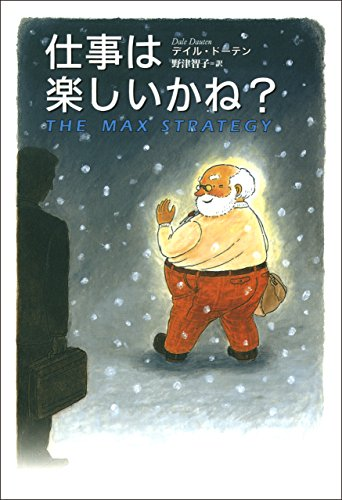

<!-- _class: top -->

# 2月読書会

2022 年 02 月 25 日
藤原　廉

---

<!-- _class: section_sp  -->

# アジェンダ

 

- 本を読んでみた所感
- 議題

---

<!-- _class: section_sp cus_pos_l_50 -->

# 所感①

 

君はたぶん何十もの素晴らしいアイデアに、
目の前を通り過ぎさせてしまっていると思うよ。

- 僕も気づいていないだけで、
素晴らしいアイデアを逃しているかものと感じた。
- 主人公と同じで自分が雇った店員が商品を勝手に食べていたら、
真っ先に叱ってそれで終わりだと思う。
- クラウドファウンディングでちょうどいいものを見つけた時に
悔しい気持ちになる。

---

<!-- _class: section_sp cus_pos_l_60 -->

# 所感②

 

新しいアイデアというのは、新しい場所に置かれた古いアイデアなんだ。

- 言語の組み合わせは、アイデアソンで実際に使用したことがある。
- 効果は実感していた。自分がクリエイティブな人間ではないと思っている僕でも、短時間で多くのアイデアを出すことができた。
- しかし、アイデアソンから3か月たったが使えるような場所はなかった。
- 多くの人と同じで問題を問題だと思う意識がないから。

---

<!-- _class: section_sp cus_pos_l_55 -->

# 議題①： 問題・アイデアを見過ごした経験は？

 

- あとからあれは自分も考えたことあるな、といったことや、
製品にしたら売れるかもと思っていることはありますか？

 

- ない場合は、どうすれば見逃さずに済むと思いますか？

---

<!-- _class: section_sp cus_pos_l_5 -->

# 議題②： アイデアで問題を解決した経験は？

 

- みなさんの身近にアイデアが必要な問題、
アイデアで解決できる問題はありますか？

 

- また、アイデアで問題を解決した経験はありますか？
小さい問題でもいいです。
